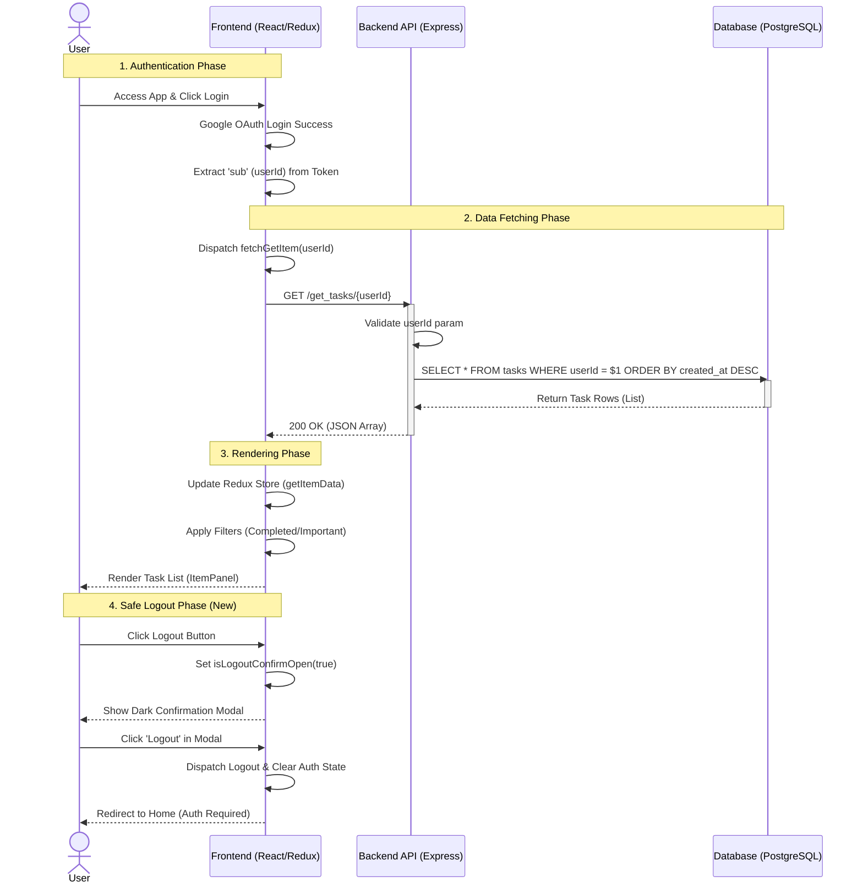

# 🏗️ System Architecture & Data Flow

**[Version: v2.10_260211]**

이 문서는 `aicc8_deploy_app`의 전체 시스템 구조와 데이터 흐름, 그리고 컴포넌트 간 상호작용을 시각적으로 상세히 기술합니다.

---

## 1. System Architecture Diagram

클라이언트(Client), 서버(Server), 데이터베이스(Database) 간의 요청 및 응답 흐름을 나타낸 다이어그램입니다.

```mermaid
graph TD
    User[User (Browser)] -->|Interaction| UI[React UI Components]
    UI -->|Dispatch Action| Redux[Redux Store]

    subgraph Frontend Logic
    Redux -->|Select State| UI
    Redux -->|Async Thunk| API[API Service (Axios/Fetch)]
    end

    API -->|HTTP Request (JSON)| Server[Express Server]

    subgraph Backend Logic
    Server -->|Routing| Router[Express Router]
    Router -->|Business Logic| Controller[Get/Post Controllers]
    Controller -->|SQL Query| DB[(PostgreSQL Database)]
    end

    DB -->|Result Set| Controller
    Controller -->|JSON Response| API
    API -->|Update State| Redux
```

---

## 2. Data Flow Analysis (Variable Lifecycle)

주요 데이터(변수)가 시스템 내에서 생성, 가공, 소멸되는 전체 생명주기(Lifecycle)를 추적합니다. **데이터 격리(Data Isolation)** 이슈나 **렌더링 버그**를 해결할 때 필수적인 참조 자료입니다.

### 2.1 Critical Data Journey Table

| 변수명 (Variable)       | 생성 위치 (Origin)        | 변경/가공 로직 (Mutation)                         | 참조/최종 목적지 (Destination)      | 비고 (Note)                                                |
| :---------------------- | :------------------------ | :------------------------------------------------ | :---------------------------------- | :--------------------------------------------------------- |
| **userId (`sub`)**      | `GoogleLogin` (Auth)      | `jwtDecode` -> `authSlice` (Redux State)          | `ItemPanel.jsx` (API Request Param) | **[Core]** 모든 데이터 조회/생성의 기준 키 (Isolation Key) |
| **isSidebarOpen**       | `Navbar.jsx` (State)      | `toggleSidebar` (Click), `Resize` (Window Event)  | `nav` className (CSS Visibility)    | 모바일/태블릿 반응형 토글 제어                             |
| **getTasksData**        | `apiSlice` (Redux)        | `fetchGetItem` (Async API Call)                   | `ItemPanel.jsx` (Rendering List)    | `null` 상태에 대한 방어 로직(Safe Guard) 필수              |
| **filteredTasks**       | `ItemPanel.jsx` (Derived) | `filter(isCompleted)` -> `filter(isImportant)`    | `Item.jsx` (Map Render)             | 렌더링 직전의 최종 가공 데이터                             |
| **isLogoutConfirmOpen** | `Navbar.jsx` (State)      | `handleLogoutClick` (Trigger) -> `confirm/cancel` | `Logout Modal` (Conditional Render) | **[Safety]** 오터치 방지 로그아웃 컨펌 창                  |
| **isTodayOpen**         | `Navbar.jsx` (State)      | `setIsTodayOpen` (Toggle)                         | `Today's Todo` (Collapsible)        | 사이드바 내 섹션 접힘/펼침 상태 저장                       |

---

## 3. Execution Flow Map (Critical Path)

사용자가 애플리케이션에 접속하여 로그인을 수행하고, 본인의 할 일 목록을 확인하기까지의 **실행 경로(Critical Path)**입니다.

1.  **Frontend Initialization (`main.jsx` -> `App.jsx`)**
    - Redux Store 생성 및 Provider 주입.
    - Router 설정 완료.

2.  **Authentication (`Navbar.jsx`)**
    - 사용자: 'Login' 버튼 클릭 -> Google OAuth 팝업.
    - **Action**: `GoogleLogin.onSuccess` -> `jwtDecode` -> `dispatch(login(decoded))`.
    - **State Change**: `authSlice.authData`에 유저 정보(`sub`, `name` 등) 저장.

3.  **Data Fetching (`ItemPanel.jsx`)**
    - **Effect**: `useEffect`가 `userKey`(`sub`) 변화를 감지.
    - **Dispatch**: `dispatch(fetchGetItem(userKey))` 실행.
    - **API Call**: `GET /get_tasks/:userId` 요청 전송.

4.  **Backend Processing (`index.js` -> `getControllers.js`)**
    - **Route**: `/get_tasks/:userId` 엔드포인트 도달.
    - **Query**: `SELECT * FROM tasks WHERE userId = $1 ORDER BY created_at DESC`.
    - **Response**: 조회된 Task 배열을 JSON 형식(200 OK)으로 반환.

5.  **UI Rendering (`ItemPanel.jsx`)**
    - **Update**: Redux Store의 `getItemData`가 최신 데이터로 업데이트됨.
    - **Filtering**: `filteredCompleted`, `filteredImportant` Props에 따라 배열 필터링.
    - **Map**: `<Item />` 컴포넌트 반복 렌더링.

---

## 4. Sequence Diagram (User Interaction Flow)

사용자와 시스템 간의 상호작용 순서를 시계열(Time Series)로 표현한 상세 다이어그램입니다.



---

## 5. Directory & File Relationship

파일 간의 물리적/논리적 연결 관계를 설명합니다.

- **`front/src/components/Common/Navbar.jsx`**
  - **역할**: 레이아웃의 핵심, 사이드바 상태(`isDesktopOpen`) 관리.
  - **연결**: `App.jsx`에서 호출되며, `authSlice`를 통해 로그인 상태를 공유함.

- **`front/src/components/Common/ItemPanel.jsx`**
  - **역할**: 할 일 목록을 보여주는 메인 뷰포트.
  - **연결**: `apiSlice.js`의 액션을 디스패치하여 데이터를 가져오고, `Item.jsx`를 자식으로 가짐.

- **`back/controllers/getControllers.js`**
  - **역할**: 프론트엔드의 요청을 받아 실제 비즈니스 로직(DB 조회)을 수행.
  - **연결**: `database.js` 모듈을 의존성으로 가짐.
